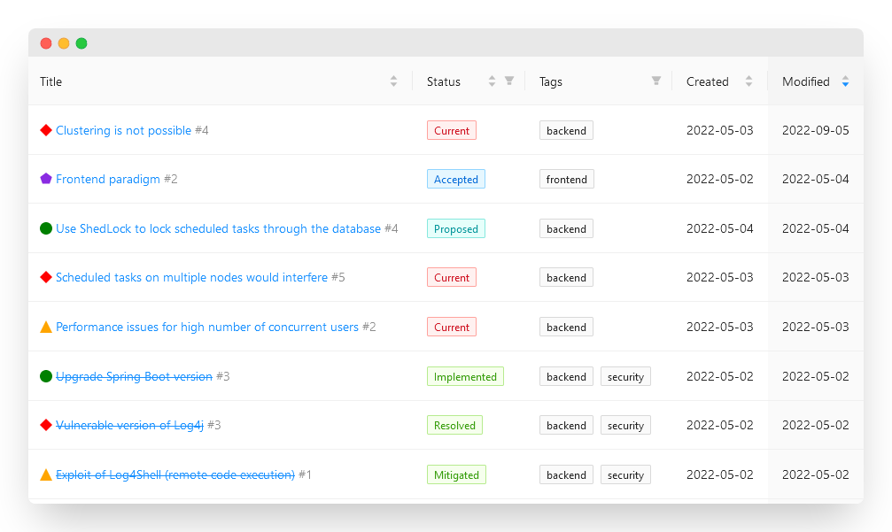
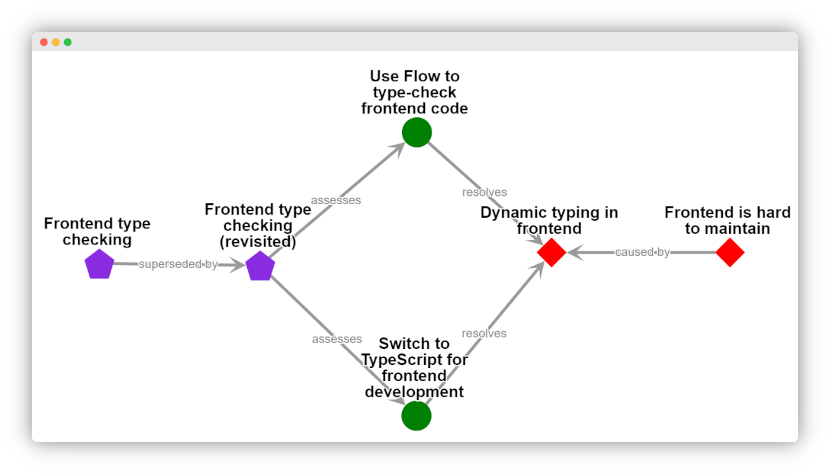

<h1 align="center">Improve your software architecture with precision!</h1>

[](https://github.com/scope42/scope42/actions/workflows/build.yml)
[](http://makeapullrequest.com)
[](https://github.com/scope42/scope42/blob/main/LICENSE)
[](https://matrix.to/#/#scope42:matrix.org)
[](https://twitter.com/scope42_org)
[](https://floss.social/@scope42)


This tool helps you to keep track of issues, arising risks and possible improvements of your existing architecture. The terminology and concepts are based on [aim42, the Architecture Improvement Method](https://www.aim42.org/).

scope42 is a Progressive Web App that runs entirely inside your browser. Click the link below to access the app.

<h3 align="center">🔗 <a href="https://app.scope42.org">app.scope42.org</a></h3>

⚠⚠⚠ **This project is currently in alpha stage. Breaking changes to the data format can happen without notice. Early feedback is very welcome and helpful to stabilize soon.**

## Features

<h3 align="center">✨ Management of items with a fancy UI</h3>



<h3 align="center">💑 Graphs for visualizing the relationships between items</h3>



<h3 align="center">📝 Docs-as-Code principle and full data ownership</h3>
<br />

```yaml
title: Upgrade Spring Boot version
created: 2022-05-02T17:25:16.909Z
modified: 2022-05-02T18:09:42.952Z
status: implemented
tags:
  - backend
  - urgent
  - security
ticket: https://github.com/scope42/scope42/issues/91
description: The current version of Spring Boot upgrades dependencies to secure
  versions of Log4j.
resolves:
  - issue-3
modifies:
  - risk-1
comments:
  - author: Jane Doe
    created: 2022-05-02T17:27:17.630Z
    content: Accepted and placed into the fast lane on the board.
```

## Roadmap

- Dashboard
- Advanced graphs
- Advanced filters for tables
- Full text search
- Integration of aim42 content
- Support for media files
- Comments on items
- Support for documenting the existing architecture (based on arc42)

## Tech Stack

- [React](https://reactjs.org)
- [Ant Design](https://ant.design)
- [Cytoscape.js](https://js.cytoscape.org/)

## Develop

Contributions are always welcome!

### `npm start`

Runs the app in the development mode. Open [http://localhost:3000](http://localhost:3000) to view it in the browser.

The page will reload if you make edits. You will also see any lint errors in the console.

### `npm test`

Launches the test runner in the interactive watch mode.
See the section about [running tests](https://facebook.github.io/create-react-app/docs/running-tests) for more information.

## License

scope42 is published under the [GNU General Public License v3.0](https://github.com/scope42/scope42/blob/main/LICENSE).

The data model and basic concepts are based on the [aim42 Method Reference](https://aim42.github.io/) by [Gernot Starke](https://www.gernotstarke.de/) and community contributors, used under [CC BY-SA](https://creativecommons.org/licenses/by-sa/4.0/).

scope42 is not affiliated with aim42.
