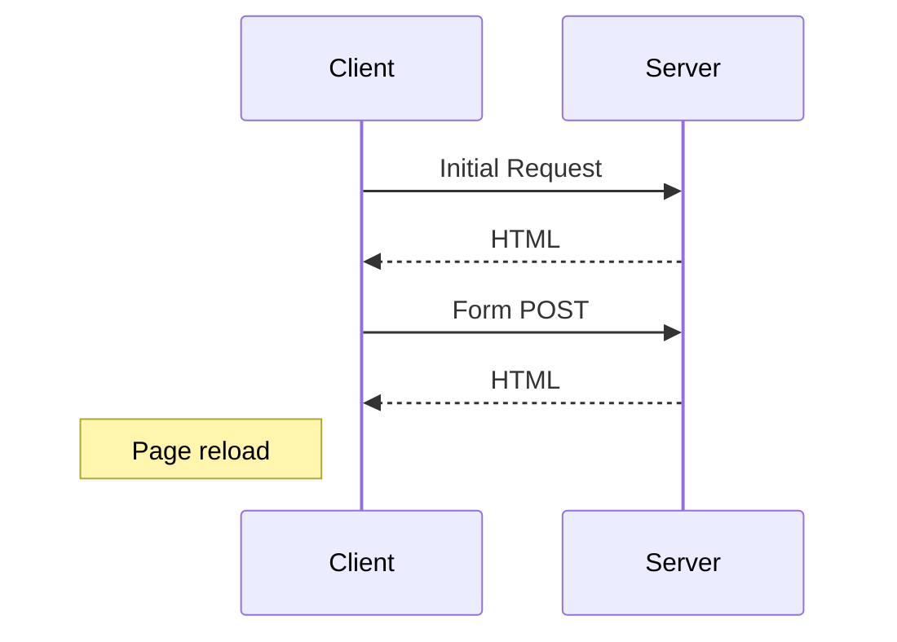
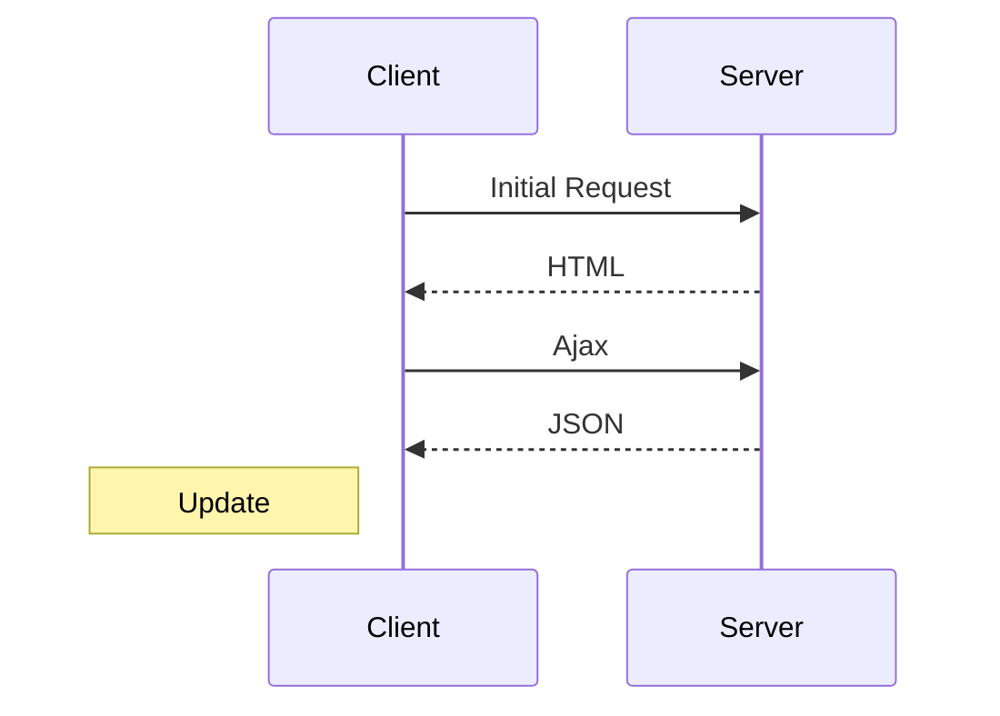
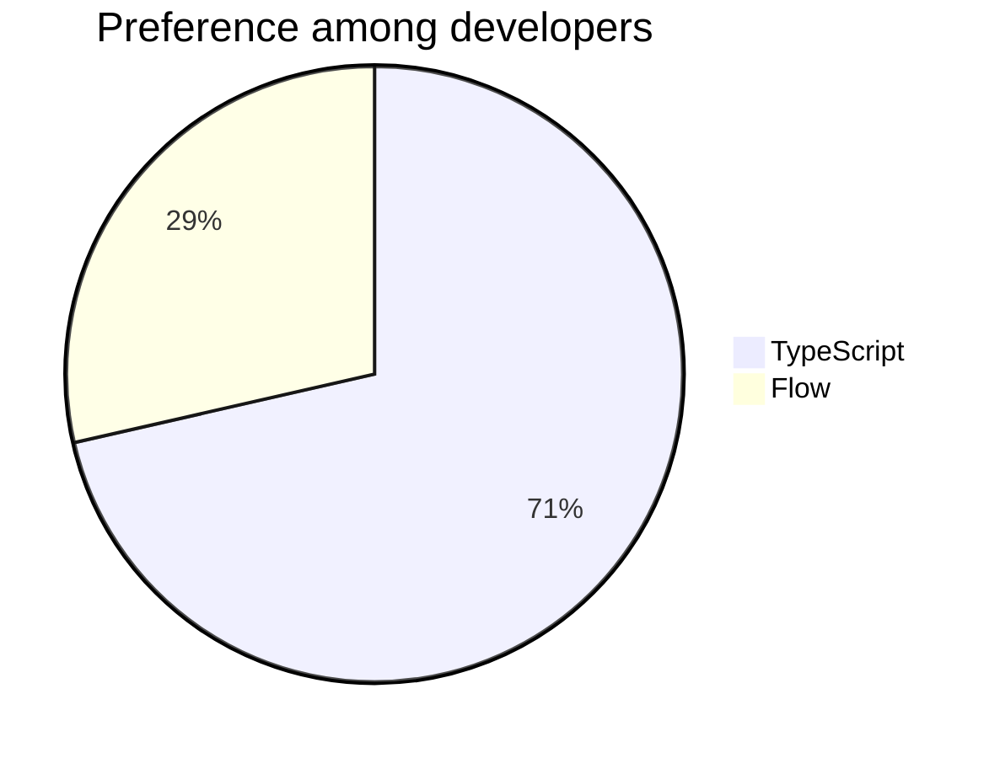

# @scope42/data Frontmatter Refactor Implementation Plan

> **For agentic workers:** REQUIRED SUB-SKILL: Use superpowers:subagent-driven-development (recommended) or superpowers:executing-plans to implement this plan task-by-task. Steps use checkbox (`- [ ]`) syntax for tracking.

**Goal:** Convert `@scope42/data` into a format-agnostic frontmatter extractor driven by `scope42.yaml`; migrate the example workspace to the new format; document the format.

**Architecture:** Zod schemas describe workspace config and per-type frontmatter only. `Workspace.readItems()` reads the config, enumerates configured directories, filters by `include`/`exclude` globs, extracts frontmatter via `gray-matter`, and returns a discriminated-union `Item[]` with `{ id, type, frontmatter, body, filePath }`. The IO adapter abstraction (node/fsa/virtual) is retained unchanged; only `workspace.ts` is rewritten.

**Tech Stack:** TypeScript, Zod, gray-matter, picomatch, Jest.

**Spec:** `docs/superpowers/specs/2026-04-19-scope42-data-frontmatter-refactor-design.md`

---

## File Structure

**Files created:**
- `packages/scope42-data/src/model/relation-patterns.ts` — anchored `RegExp`s for markdown/asciidoc/obsidian link formats, keyed by relation type name.
- `packages/scope42-data/src/model/relation-patterns.test.ts` — unit tests for the three built-in patterns.
- `packages/scope42-data/src/model/workspace-config.test.ts` — unit tests for the workspace-config schema.
- `packages/scope42-data/src/model/frontmatter-schemas.test.ts` — unit tests for the four per-type frontmatter schemas.
- `example/scope42.yaml` — new-format workspace config.
- `example/docs/issues/*.md`, `example/docs/risks/*.md`, `example/docs/improvements/*.md`, `example/docs/decisions/*.md` — migrated items.
- `FORMAT.md` (repo root) — format specification.

**Files rewritten:**
- `packages/scope42-data/src/model/workspace-config.ts` — full rewrite.
- `packages/scope42-data/src/model/item-base.ts` — reduced to `ItemType` + `ItemBase<T, F>`.
- `packages/scope42-data/src/model/issue.ts` / `risk.ts` / `improvement.ts` / `decision.ts` — reduced to frontmatter schemas + type aliases.
- `packages/scope42-data/src/model/index.ts` — updated re-exports.
- `packages/scope42-data/src/io/workspace.ts` — full rewrite against new schemas.
- `packages/scope42-data/src/io/workspace.test.ts` — full rewrite using the existing `testWs(content)` helper.
- `packages/scope42-data/src/index.ts` — reviewed; already re-exports via `./model`, `./io`, `./utils`.
- `packages/scope42-data/README.md` — replace placeholder with real content.
- `examples/data-processing/src/index.ts` — point to new `example/` workspace.

**Files deleted:**
- `packages/scope42-data/src/model/item-id.ts`
- `packages/scope42-data/src/utils.ts` (obsolete after ID/status helpers disappear)

**Files adorned with file-level comments:**
- `packages/scope42-data/src/io/adapters/api.ts`
- `packages/scope42-data/src/io/adapters/node.ts`
- `packages/scope42-data/src/io/adapters/fsa.ts`
- `packages/scope42-data/src/io/adapters/virtual.ts`

---

## Task 1: Install new dependencies

**Files:**
- Modify: `packages/scope42-data/package.json`
- Modify: `package-lock.json` (auto-updated)

- [ ] **Step 1: Add gray-matter, picomatch, and their types**

Run (from repo root):

```bash
npm install --workspace packages/scope42-data gray-matter@^4.0.3 picomatch@^4.0.2
npm install --workspace packages/scope42-data --save-dev @types/picomatch@^3.0.1
```

Expected: `dependencies` in `packages/scope42-data/package.json` gains `gray-matter` and `picomatch`; `devDependencies` gains `@types/picomatch`. `gray-matter` ships its own types — no `@types/gray-matter` needed.

- [ ] **Step 2: Verify TS can resolve the new modules**

Run:

```bash
cd packages/scope42-data && npx tsc --noEmit
```

Expected: exits 0.

- [ ] **Step 3: Commit**

```bash
git add packages/scope42-data/package.json package-lock.json
git commit -m "chore(data): add gray-matter and picomatch dependencies"
```

---

## Task 2: Write the workspace-config schema tests

**Files:**
- Create: `packages/scope42-data/src/model/workspace-config.test.ts`

- [ ] **Step 1: Write the failing tests**

Create `packages/scope42-data/src/model/workspace-config.test.ts`:

```ts
import { WorkspaceConfigSchema } from './workspace-config'

const minimal = {
  items: { issue: 'docs/issues' },
  include: ['*.md']
}

describe('WorkspaceConfigSchema', () => {
  test('parses minimal valid config and applies defaults', () => {
    const parsed = WorkspaceConfigSchema.parse(minimal)
    expect(parsed.items.issue).toBe('docs/issues')
    expect(parsed.exclude).toEqual([])
    expect(parsed.validation).toEqual({
      fileNamePattern: undefined,
      relationPattern: undefined
    })
  })

  test('rejects empty include array', () => {
    expect(() =>
      WorkspaceConfigSchema.parse({ ...minimal, include: [] })
    ).toThrow()
  })

  test('rejects unknown top-level key', () => {
    expect(() =>
      WorkspaceConfigSchema.parse({ ...minimal, foo: 'bar' })
    ).toThrow()
  })

  test('rejects unknown key inside items', () => {
    expect(() =>
      WorkspaceConfigSchema.parse({
        ...minimal,
        items: { issue: 'docs/issues', foo: 'docs/foo' }
      })
    ).toThrow()
  })

  test('accepts all four item-type keys', () => {
    const parsed = WorkspaceConfigSchema.parse({
      items: {
        issue: 'i',
        risk: 'r',
        improvement: 'im',
        decision: 'd'
      },
      include: ['*.md']
    })
    expect(parsed.items).toEqual({
      issue: 'i',
      risk: 'r',
      improvement: 'im',
      decision: 'd'
    })
  })

  test('compiles fileNamePattern to RegExp', () => {
    const parsed = WorkspaceConfigSchema.parse({
      ...minimal,
      validation: { fileNamePattern: '[0-9]{3} .+' }
    })
    expect(parsed.validation.fileNamePattern).toBeInstanceOf(RegExp)
    expect(parsed.validation.fileNamePattern!.test('001 Foo')).toBe(true)
    expect(parsed.validation.fileNamePattern!.test('foo')).toBe(false)
  })

  test('compiles relationPattern to RegExp', () => {
    const parsed = WorkspaceConfigSchema.parse({
      ...minimal,
      validation: { relationPattern: '^x$' }
    })
    expect(parsed.validation.relationPattern).toBeInstanceOf(RegExp)
    expect(parsed.validation.relationPattern!.test('x')).toBe(true)
  })

  test('relationType produces the matching built-in pattern', () => {
    const parsed = WorkspaceConfigSchema.parse({
      ...minimal,
      validation: { relationType: 'markdown-link' }
    })
    expect(parsed.validation.relationPattern).toBeInstanceOf(RegExp)
    expect(
      parsed.validation.relationPattern!.test('[x](foo.md)')
    ).toBe(true)
  })

  test('rejects relationPattern and relationType together', () => {
    expect(() =>
      WorkspaceConfigSchema.parse({
        ...minimal,
        validation: {
          relationPattern: '^x$',
          relationType: 'markdown-link'
        }
      })
    ).toThrow()
  })

  test('rejects invalid regex syntax in fileNamePattern', () => {
    expect(() =>
      WorkspaceConfigSchema.parse({
        ...minimal,
        validation: { fileNamePattern: '[unterminated' }
      })
    ).toThrow(/Invalid regex/)
  })
})
```

- [ ] **Step 2: Run tests to verify they fail**

Run:

```bash
npx jest --config packages/scope42-data/jest.config.js packages/scope42-data/src/model/workspace-config.test.ts
```

Expected: FAIL because the new `WorkspaceConfigSchema` does not yet exist in the form expected (current file exports only `version`).

**Note:** if `packages/scope42-data/jest.config.js` does not exist, use `cd packages/scope42-data && npx jest src/model/workspace-config.test.ts` instead. The rest of the plan uses the workspace-script form.

- [ ] **Step 3: Commit the failing tests**

```bash
git add packages/scope42-data/src/model/workspace-config.test.ts
git commit -m "test(data): add workspace config schema tests (red)"
```

---

## Task 3: Implement the workspace-config schema

**Files:**
- Create: `packages/scope42-data/src/model/relation-patterns.ts`
- Rewrite: `packages/scope42-data/src/model/workspace-config.ts`

- [ ] **Step 1: Create `relation-patterns.ts`**

```ts
/**
 * Built-in anchored regex patterns, one per supported relation-link syntax.
 * A relation value must match the pattern in full; capture group 1 contains
 * the relation target. These are consumed by the linter (see #433); this
 * library does not apply them.
 */
export const RELATION_TYPES = ['markdown-link', 'asciidoc-link', 'obsidian-link'] as const
export type RelationType = typeof RELATION_TYPES[number]

export const RELATION_TYPE_PATTERNS: Record<RelationType, RegExp> = {
  'markdown-link': /^\[[^\]]*\]\(([^)]+)\)$/,
  'asciidoc-link': /^<<([^,>]+)(?:,[^>]*)?>>$/,
  'obsidian-link': /^\[\[([^|\]]+)(?:\|[^\]]+)?\]\]$/
}
```

- [ ] **Step 2: Rewrite `workspace-config.ts`**

Replace the whole file with:

```ts
/* eslint-disable @typescript-eslint/no-redeclare */
import { z } from 'zod'
import {
  RELATION_TYPES,
  RELATION_TYPE_PATTERNS
} from './relation-patterns'

// Parses a regex string and exposes a compiled RegExp. Invalid syntax is
// reported as a Zod issue at parse time.
const RegexString = z.string().transform((val, ctx) => {
  try {
    return new RegExp(val)
  } catch (e) {
    ctx.addIssue({
      code: z.ZodIssueCode.custom,
      message: `Invalid regex: ${(e as Error).message}`
    })
    return z.NEVER
  }
})

const ValidationConfig = z
  .object({
    fileNamePattern: RegexString.optional().describe(
      'Regex that every item file name (without extension) must match. ' +
        'Informational only; enforced by the linter, not by this library.'
    ),
    relationPattern: RegexString.optional().describe(
      'Anchored regex that every relation value must match in full. ' +
        'Capture group 1 must contain the relation target. Mutually ' +
        'exclusive with relationType.'
    ),
    relationType: z
      .enum(RELATION_TYPES)
      .optional()
      .describe(
        'Shorthand for relationPattern that selects a built-in pattern. ' +
          'Mutually exclusive with relationPattern.'
      )
  })
  .strict()
  .refine(v => !(v.relationPattern && v.relationType), {
    message: 'relationPattern and relationType are mutually exclusive',
    path: ['relationType']
  })
  .transform(v => ({
    fileNamePattern: v.fileNamePattern,
    // After transform, only relationPattern is exposed as a compiled RegExp.
    // The user's original intent (pattern or type) is collapsed into a single
    // effective RegExp.
    relationPattern:
      v.relationPattern ??
      (v.relationType ? RELATION_TYPE_PATTERNS[v.relationType] : undefined)
  }))

export const WorkspaceConfigSchema = z
  .object({
    items: z
      .object({
        issue: z
          .string()
          .min(1)
          .optional()
          .describe('Path to the issue directory, workspace-relative.'),
        risk: z
          .string()
          .min(1)
          .optional()
          .describe('Path to the risk directory, workspace-relative.'),
        improvement: z
          .string()
          .min(1)
          .optional()
          .describe('Path to the improvement directory, workspace-relative.'),
        decision: z
          .string()
          .min(1)
          .optional()
          .describe('Path to the decision directory, workspace-relative.')
      })
      .strict()
      .describe(
        'Mapping of item types to workspace-relative directory paths.'
      ),
    include: z
      .array(z.string().min(1))
      .min(1)
      .describe(
        'Globs matched against file names (not full paths) in item ' +
          'directories. At least one entry required.'
      ),
    exclude: z
      .array(z.string().min(1))
      .default([])
      .describe(
        'Globs matched against file names (not full paths) to skip. ' +
          'Applied after include.'
      ),
    validation: ValidationConfig.default({}).describe(
      'Patterns consumed by external tools such as the linter; not ' +
        'enforced by this library.'
    )
  })
  .strict()

export type WorkspaceConfig = z.infer<typeof WorkspaceConfigSchema>
```

- [ ] **Step 3: Run tests to verify they pass**

Run:

```bash
npm --workspace packages/scope42-data test -- src/model/workspace-config.test.ts
```

Expected: all tests in `workspace-config.test.ts` PASS.

- [ ] **Step 4: Commit**

```bash
git add packages/scope42-data/src/model/relation-patterns.ts packages/scope42-data/src/model/workspace-config.ts
git commit -m "feat(data): rewrite WorkspaceConfig schema (items + include/exclude + validation)"
```

---

## Task 4: Write and verify relation-pattern tests

**Files:**
- Create: `packages/scope42-data/src/model/relation-patterns.test.ts`

- [ ] **Step 1: Write the tests**

```ts
import { RELATION_TYPE_PATTERNS } from './relation-patterns'

const md = RELATION_TYPE_PATTERNS['markdown-link']
const adoc = RELATION_TYPE_PATTERNS['asciidoc-link']
const obs = RELATION_TYPE_PATTERNS['obsidian-link']

describe('markdown-link pattern', () => {
  test.each([
    ['[x](foo.md)', 'foo.md'],
    ['[](foo.md)', 'foo.md'],
    ['[x](../a/b.md)', '../a/b.md'],
    ['[A title](001 Foo.md)', '001 Foo.md']
  ])('%s captures %s', (input, target) => {
    const m = input.match(md)
    expect(m).not.toBeNull()
    expect(m![1]).toBe(target)
  })

  test.each([
    '[x]',
    '[x](foo)tail',
    'head[x](foo)',
    'plain text',
    '(foo.md)'
  ])('rejects %s', input => {
    expect(md.test(input)).toBe(false)
  })
})

describe('asciidoc-link pattern', () => {
  test.each([
    ['<<foo>>', 'foo'],
    ['<<foo,Text>>', 'foo'],
    ['<<foo bar>>', 'foo bar']
  ])('%s captures %s', (input, target) => {
    const m = input.match(adoc)
    expect(m).not.toBeNull()
    expect(m![1]).toBe(target)
  })

  test.each(['<<foo>>tail', '<< >>', '<<foo', 'head<<foo>>'])(
    'rejects %s',
    input => {
      expect(adoc.test(input)).toBe(false)
    }
  )
})

describe('obsidian-link pattern', () => {
  test.each([
    ['[[issue-1]]', 'issue-1'],
    ['[[issue-1|Alias]]', 'issue-1'],
    ['[[a/b/c]]', 'a/b/c']
  ])('%s captures %s', (input, target) => {
    const m = input.match(obs)
    expect(m).not.toBeNull()
    expect(m![1]).toBe(target)
  })

  test.each(['[[]]', '[[a|b|c]]', '[[a]]tail', '[a]', 'foo'])(
    'rejects %s',
    input => {
      expect(obs.test(input)).toBe(false)
    }
  )
})
```

- [ ] **Step 2: Run tests**

```bash
npm --workspace packages/scope42-data test -- src/model/relation-patterns.test.ts
```

Expected: all PASS.

- [ ] **Step 3: Commit**

```bash
git add packages/scope42-data/src/model/relation-patterns.test.ts
git commit -m "test(data): add built-in relation-pattern matchers"
```

---

## Task 5: Write frontmatter-schema tests (red)

**Files:**
- Create: `packages/scope42-data/src/model/frontmatter-schemas.test.ts`

- [ ] **Step 1: Write the failing tests**

```ts
import { IssueFrontmatterSchema } from './issue'
import { RiskFrontmatterSchema } from './risk'
import { ImprovementFrontmatterSchema } from './improvement'
import { DecisionFrontmatterSchema } from './decision'

describe('IssueFrontmatterSchema', () => {
  test('parses minimal valid frontmatter and applies defaults', () => {
    const parsed = IssueFrontmatterSchema.parse({ status: 'current' })
    expect(parsed.status).toBe('current')
    expect(parsed.tags).toEqual([])
    expect(parsed.causedBy).toEqual([])
  })

  test('rejects invalid status', () => {
    expect(() =>
      IssueFrontmatterSchema.parse({ status: 'bogus' })
    ).toThrow()
  })

  test('rejects missing status', () => {
    expect(() => IssueFrontmatterSchema.parse({})).toThrow()
  })

  test('passes through unknown fields (e.g. ticket)', () => {
    const parsed = IssueFrontmatterSchema.parse({
      status: 'current',
      ticket: 'https://x',
      obsidianCustom: 42
    }) as Record<string, unknown>
    expect(parsed.ticket).toBe('https://x')
    expect(parsed.obsidianCustom).toBe(42)
  })

  test('keeps relations as strings', () => {
    const parsed = IssueFrontmatterSchema.parse({
      status: 'current',
      causedBy: ['[foo](foo.md)', 'issue-2']
    })
    expect(parsed.causedBy).toEqual(['[foo](foo.md)', 'issue-2'])
  })
})

describe('RiskFrontmatterSchema', () => {
  test('parses minimal valid frontmatter', () => {
    const parsed = RiskFrontmatterSchema.parse({ status: 'potential' })
    expect(parsed.status).toBe('potential')
    expect(parsed.causedBy).toEqual([])
  })

  test('rejects invalid status', () => {
    expect(() =>
      RiskFrontmatterSchema.parse({ status: 'current-ish' })
    ).toThrow()
  })
})

describe('ImprovementFrontmatterSchema', () => {
  test('parses valid frontmatter', () => {
    const parsed = ImprovementFrontmatterSchema.parse({
      status: 'proposed',
      resolves: ['issue-1']
    })
    expect(parsed.resolves).toEqual(['issue-1'])
    expect(parsed.modifies).toEqual([])
    expect(parsed.creates).toEqual([])
  })

  test('rejects empty resolves array', () => {
    expect(() =>
      ImprovementFrontmatterSchema.parse({
        status: 'proposed',
        resolves: []
      })
    ).toThrow()
  })

  test('rejects missing resolves', () => {
    expect(() =>
      ImprovementFrontmatterSchema.parse({ status: 'proposed' })
    ).toThrow()
  })
})

describe('DecisionFrontmatterSchema', () => {
  test('parses minimal frontmatter', () => {
    const parsed = DecisionFrontmatterSchema.parse({ status: 'proposed' })
    expect(parsed.status).toBe('proposed')
    expect(parsed.assesses).toEqual([])
  })

  test('coerces decided ISO string to Date', () => {
    const parsed = DecisionFrontmatterSchema.parse({
      status: 'accepted',
      decided: '2025-01-15T00:00:00.000Z'
    })
    expect(parsed.decided).toBeInstanceOf(Date)
    expect(parsed.decided!.toISOString()).toBe('2025-01-15T00:00:00.000Z')
  })

  test('accepts supersededBy as plain string', () => {
    const parsed = DecisionFrontmatterSchema.parse({
      status: 'superseded',
      supersededBy: '[next](002 Next.md)'
    })
    expect(parsed.supersededBy).toBe('[next](002 Next.md)')
  })

  test('rejects invalid status', () => {
    expect(() =>
      DecisionFrontmatterSchema.parse({ status: 'bogus' })
    ).toThrow()
  })
})
```

- [ ] **Step 2: Run tests to verify they fail**

```bash
npm --workspace packages/scope42-data test -- src/model/frontmatter-schemas.test.ts
```

Expected: FAIL (schemas don't exist in this form yet).

- [ ] **Step 3: Commit**

```bash
git add packages/scope42-data/src/model/frontmatter-schemas.test.ts
git commit -m "test(data): add per-type frontmatter schema tests (red)"
```

---

## Task 6: Rewrite per-type frontmatter schemas

**Files:**
- Rewrite: `packages/scope42-data/src/model/issue.ts`
- Rewrite: `packages/scope42-data/src/model/risk.ts`
- Rewrite: `packages/scope42-data/src/model/improvement.ts`
- Rewrite: `packages/scope42-data/src/model/decision.ts`

- [ ] **Step 1: Replace `issue.ts`**

```ts
import { z } from 'zod'

export const IssueStatuses = ['current', 'resolved', 'discarded'] as const
export type IssueStatus = typeof IssueStatuses[number]

export const IssueFrontmatterSchema = z
  .object({
    status: z.enum(IssueStatuses),
    tags: z.array(z.string().min(1)).default([]),
    causedBy: z.array(z.string().min(1)).default([])
  })
  .passthrough()

export type IssueFrontmatter = z.infer<typeof IssueFrontmatterSchema>
```

- [ ] **Step 2: Replace `risk.ts`**

```ts
import { z } from 'zod'

export const RiskStatuses = [
  'potential',
  'current',
  'mitigated',
  'discarded'
] as const
export type RiskStatus = typeof RiskStatuses[number]

export const RiskFrontmatterSchema = z
  .object({
    status: z.enum(RiskStatuses),
    tags: z.array(z.string().min(1)).default([]),
    causedBy: z.array(z.string().min(1)).default([])
  })
  .passthrough()

export type RiskFrontmatter = z.infer<typeof RiskFrontmatterSchema>
```

- [ ] **Step 3: Replace `improvement.ts`**

```ts
import { z } from 'zod'

export const ImprovementStatuses = [
  'proposed',
  'accepted',
  'implemented',
  'discarded'
] as const
export type ImprovementStatus = typeof ImprovementStatuses[number]

export const ImprovementFrontmatterSchema = z
  .object({
    status: z.enum(ImprovementStatuses),
    tags: z.array(z.string().min(1)).default([]),
    resolves: z.array(z.string().min(1)).min(1),
    modifies: z.array(z.string().min(1)).default([]),
    creates: z.array(z.string().min(1)).default([])
  })
  .passthrough()

export type ImprovementFrontmatter = z.infer<
  typeof ImprovementFrontmatterSchema
>
```

- [ ] **Step 4: Replace `decision.ts`**

```ts
import { z } from 'zod'

export const DecisionStatuses = [
  'proposed',
  'accepted',
  'deprecated',
  'superseded',
  'discarded'
] as const
export type DecisionStatus = typeof DecisionStatuses[number]

export const DecisionFrontmatterSchema = z
  .object({
    status: z.enum(DecisionStatuses),
    tags: z.array(z.string().min(1)).default([]),
    supersededBy: z.string().min(1).optional(),
    assesses: z.array(z.string().min(1)).default([]),
    decided: z.coerce.date().optional()
  })
  .passthrough()

export type DecisionFrontmatter = z.infer<typeof DecisionFrontmatterSchema>
```

- [ ] **Step 5: Run tests**

```bash
npm --workspace packages/scope42-data test -- src/model/frontmatter-schemas.test.ts
```

Expected: all PASS.

- [ ] **Step 6: Commit**

```bash
git add packages/scope42-data/src/model/issue.ts packages/scope42-data/src/model/risk.ts packages/scope42-data/src/model/improvement.ts packages/scope42-data/src/model/decision.ts
git commit -m "feat(data): slim per-type frontmatter schemas, drop prose fields"
```

---

## Task 7: Reduce `item-base.ts` and delete obsolete model files

**Files:**
- Rewrite: `packages/scope42-data/src/model/item-base.ts`
- Delete: `packages/scope42-data/src/model/item-id.ts`

- [ ] **Step 1: Replace `item-base.ts`**

```ts
/* eslint-disable @typescript-eslint/no-redeclare */
import { z } from 'zod'

export const ItemType = z.enum(['issue', 'risk', 'improvement', 'decision'])
export type ItemType = z.infer<typeof ItemType>

/**
 * Shape of a loaded item: its inferred id and type, the parsed frontmatter
 * of the corresponding schema, the raw body text, and the workspace-relative
 * file path. Used as a generic parameter base by the per-type aliases in
 * `./index.ts`.
 */
export interface ItemBase<T extends ItemType, F> {
  id: string
  type: T
  frontmatter: F
  body: string
  filePath: string
}
```

- [ ] **Step 2: Delete `item-id.ts`**

```bash
git rm packages/scope42-data/src/model/item-id.ts
```

- [ ] **Step 3: Commit**

```bash
git add packages/scope42-data/src/model/item-base.ts
git commit -m "refactor(data): reduce item-base to ItemType + ItemBase; drop item-id"
```

---

## Task 8: Update `model/index.ts` re-exports

**Files:**
- Rewrite: `packages/scope42-data/src/model/index.ts`

- [ ] **Step 1: Replace the file**

```ts
import { ItemBase, ItemType } from './item-base'
import {
  IssueFrontmatter,
  IssueFrontmatterSchema,
  IssueStatus,
  IssueStatuses
} from './issue'
import {
  RiskFrontmatter,
  RiskFrontmatterSchema,
  RiskStatus,
  RiskStatuses
} from './risk'
import {
  ImprovementFrontmatter,
  ImprovementFrontmatterSchema,
  ImprovementStatus,
  ImprovementStatuses
} from './improvement'
import {
  DecisionFrontmatter,
  DecisionFrontmatterSchema,
  DecisionStatus,
  DecisionStatuses
} from './decision'

export { ItemType }
export {
  IssueFrontmatterSchema,
  IssueStatuses,
  RiskFrontmatterSchema,
  RiskStatuses,
  ImprovementFrontmatterSchema,
  ImprovementStatuses,
  DecisionFrontmatterSchema,
  DecisionStatuses
}
export type {
  IssueFrontmatter,
  IssueStatus,
  RiskFrontmatter,
  RiskStatus,
  ImprovementFrontmatter,
  ImprovementStatus,
  DecisionFrontmatter,
  DecisionStatus
}

export * from './workspace-config'
export * from './relation-patterns'

export type Issue = ItemBase<'issue', IssueFrontmatter>
export type Risk = ItemBase<'risk', RiskFrontmatter>
export type Improvement = ItemBase<'improvement', ImprovementFrontmatter>
export type Decision = ItemBase<'decision', DecisionFrontmatter>

export type Item = Issue | Risk | Improvement | Decision
```

- [ ] **Step 2: Run build to confirm types compile**

```bash
npm --workspace packages/scope42-data run build
```

Expected: the workspace.ts file still imports old names and will fail here — that's OK for now; proceed to Task 9 without committing.

**If you want an intermediate commit-safe state:** skip the build check here; it will pass after Task 11.

- [ ] **Step 3: Stage (do not commit yet)**

```bash
git add packages/scope42-data/src/model/index.ts
```

Commit together with Task 11's workspace rewrite so the package builds again.

---

## Task 9: Delete `utils.ts`

**Files:**
- Delete: `packages/scope42-data/src/utils.ts`
- Modify: `packages/scope42-data/src/index.ts`

- [ ] **Step 1: Verify nothing outside `packages/scope42-data/src/` imports from `utils`**

Run (from repo root):

```bash
grep -rn "from '@scope42/data/dist/utils'" .
grep -rn "getItemTypeFromId\|getSerialFromItemId\|getItemIdFromSerial\|statusLabel\|statusActive" app/ examples/ website/ packages/ --include='*.ts' --include='*.tsx'
```

Expected output: only matches inside `packages/scope42-data/src/` (the to-be-deleted file) and `app/` consumers (which are not used by this task — `app/` is removed in #434). Any remaining non-`app/` consumer must be fixed before continuing.

- [ ] **Step 2: Delete the file**

```bash
git rm packages/scope42-data/src/utils.ts
```

- [ ] **Step 3: Remove the re-export**

Open `packages/scope42-data/src/index.ts` and delete the `export * from './utils'` line so the file reads:

```ts
export * from './model'
export * from './io'
```

- [ ] **Step 4: Stage**

```bash
git add packages/scope42-data/src/index.ts
```

Commit together with Task 11.

---

## Task 10: Add file-level comments to IO adapters

**Files:**
- Modify (prepend comment): `packages/scope42-data/src/io/adapters/api.ts`
- Modify (prepend comment): `packages/scope42-data/src/io/adapters/node.ts`
- Modify (prepend comment): `packages/scope42-data/src/io/adapters/fsa.ts`
- Modify (prepend comment): `packages/scope42-data/src/io/adapters/virtual.ts`

- [ ] **Step 1: Prepend the comments**

Prepend to `api.ts`:

```ts
/**
 * Abstract IO interface (DirectoryHandle, FileHandle) that all adapters
 * implement. The workspace loader is written against this interface so it
 * can run on any backing filesystem representation.
 */
```

Prepend to `node.ts`:

```ts
/**
 * IO adapter backed by Node.js' `fs` / `path` APIs. Used by Node consumers
 * such as the linter CLI, tests running outside a browser, and the example
 * in `examples/data-processing`.
 */
```

Prepend to `fsa.ts`:

```ts
/**
 * IO adapter backed by the browser's File System Access API. Retained for
 * potential future browser-based consumers; not used by the current tooling
 * but kept as a stable extension point.
 */
```

Prepend to `virtual.ts`:

```ts
/**
 * In-memory IO adapter used for unit tests. Holds a synthetic directory
 * tree as a plain object — no real filesystem access — so tests can build
 * fixture workspaces inline.
 */
```

- [ ] **Step 2: Commit**

```bash
git add packages/scope42-data/src/io/adapters/api.ts packages/scope42-data/src/io/adapters/node.ts packages/scope42-data/src/io/adapters/fsa.ts packages/scope42-data/src/io/adapters/virtual.ts
git commit -m "docs(data): add file-level comments to IO adapters"
```

---

## Task 11: Rewrite the workspace loader and its tests

**Files:**
- Rewrite: `packages/scope42-data/src/io/workspace.ts`
- Rewrite: `packages/scope42-data/src/io/workspace.test.ts`

- [ ] **Step 1: Rewrite the tests first**

Replace `packages/scope42-data/src/io/workspace.test.ts` with:

```ts
import {
  VirtualDirectoryContent,
  VirtualDirectoryHandle
} from './adapters'
import { Workspace } from './workspace'

function testWs(content: VirtualDirectoryContent) {
  return new Workspace(new VirtualDirectoryHandle('test-ws', content))
}

const CONFIG = `
items:
  issue: docs/issues
  risk: docs/risks
  improvement: docs/improvements
  decision: docs/decisions
include: ["*.md"]
exclude: ["README.md"]
`

function item(status: string, extra = ''): string {
  return `---\nstatus: ${status}\n${extra}---\n# Title\n\nBody.\n`
}

test('missing scope42.yaml throws', async () => {
  await expect(testWs({}).readItems()).rejects.toThrow(/scope42\.yaml/)
})

test('invalid config throws', async () => {
  await expect(
    testWs({
      'scope42.yaml': 'items: {}\n'
    }).readItems()
  ).rejects.toThrow()
})

test('configured path missing in tree throws', async () => {
  await expect(
    testWs({
      'scope42.yaml': CONFIG
    }).readItems()
  ).rejects.toThrow(/docs\/issues/)
})

test('happy path: loads items across all four types', async () => {
  const items = await testWs({
    'scope42.yaml': CONFIG,
    docs: {
      issues: { '001 Foo.md': item('current') },
      risks: { '001 Bar.md': item('potential') },
      improvements: {
        '001 Baz.md': item('proposed', 'resolves: ["x"]\n')
      },
      decisions: { '001 Qux.md': item('accepted') }
    }
  }).readItems()

  expect(items).toHaveLength(4)
  const byType = Object.fromEntries(items.map(i => [i.type, i]))

  expect(byType.issue.id).toBe('001 Foo')
  expect(byType.issue.filePath).toBe('docs/issues/001 Foo.md')
  expect(byType.issue.frontmatter.status).toBe('current')
  expect(byType.issue.body.trim()).toBe('# Title\n\nBody.'.trim())

  expect(byType.risk.frontmatter.status).toBe('potential')
  expect(byType.improvement.frontmatter.resolves).toEqual(['x'])
  expect(byType.decision.frontmatter.status).toBe('accepted')
})

test('include/exclude filters apply to file names', async () => {
  const items = await testWs({
    'scope42.yaml': CONFIG,
    docs: {
      issues: {
        '001 Foo.md': item('current'),
        'README.md': '# Readme only\n',
        'notes.txt': 'ignored'
      }
    }
  }).readItems()

  expect(items).toHaveLength(1)
  expect(items[0].id).toBe('001 Foo')
})

test('file in include without frontmatter throws with path', async () => {
  await expect(
    testWs({
      'scope42.yaml': CONFIG,
      docs: {
        issues: {
          '001 Foo.md': '# No frontmatter here\n'
        }
      }
    }).readItems()
  ).rejects.toThrow(/001 Foo\.md/)
})

test('invalid frontmatter reports file path', async () => {
  await expect(
    testWs({
      'scope42.yaml': CONFIG,
      docs: {
        issues: { '001 Foo.md': item('bogus') }
      }
    }).readItems()
  ).rejects.toThrow(/001 Foo\.md/)
})

test('multi-format: .md and .adoc parse identically', async () => {
  const items = await testWs({
    'scope42.yaml': `
items:
  issue: docs/issues
include: ["*.md", "*.adoc"]
`,
    docs: {
      issues: {
        '001 Foo.md': item('current'),
        '002 Bar.adoc': item('current')
      }
    }
  }).readItems()

  expect(items).toHaveLength(2)
  const ids = items.map(i => i.id).sort()
  expect(ids).toEqual(['001 Foo', '002 Bar'])
  for (const it of items) expect(it.frontmatter.status).toBe('current')
})

test('non-configured types are skipped', async () => {
  const items = await testWs({
    'scope42.yaml': `
items:
  issue: docs/issues
include: ["*.md"]
`,
    docs: {
      issues: { '001 Foo.md': item('current') }
    }
  }).readItems()

  expect(items).toHaveLength(1)
  expect(items[0].type).toBe('issue')
})
```

- [ ] **Step 2: Run tests to verify they fail**

```bash
npm --workspace packages/scope42-data test -- src/io/workspace.test.ts
```

Expected: FAIL — current `workspace.ts` still uses the old schemas.

- [ ] **Step 3: Rewrite `workspace.ts`**

Replace the whole file with:

```ts
import matter from 'gray-matter'
import picomatch from 'picomatch'
import YAML from 'yaml'
import {
  DecisionFrontmatterSchema,
  ImprovementFrontmatterSchema,
  IssueFrontmatterSchema,
  Item,
  ItemType,
  RiskFrontmatterSchema,
  WorkspaceConfig,
  WorkspaceConfigSchema
} from '../model'
import { DirectoryHandle, FileHandle } from './adapters/api'

const WORKSPACE_CONFIG_FILE = 'scope42.yaml'

type FrontmatterSchema =
  | typeof IssueFrontmatterSchema
  | typeof RiskFrontmatterSchema
  | typeof ImprovementFrontmatterSchema
  | typeof DecisionFrontmatterSchema

const SCHEMA_BY_TYPE: Record<ItemType, FrontmatterSchema> = {
  issue: IssueFrontmatterSchema,
  risk: RiskFrontmatterSchema,
  improvement: ImprovementFrontmatterSchema,
  decision: DecisionFrontmatterSchema
}

export class Workspace {
  constructor(public readonly rootDirectory: DirectoryHandle) {}

  async readConfig(): Promise<WorkspaceConfig> {
    let file: FileHandle
    try {
      file = await this.rootDirectory.resolveFile(WORKSPACE_CONFIG_FILE)
    } catch (e) {
      throw new Error(
        `Could not find ${WORKSPACE_CONFIG_FILE} in workspace root`
      )
    }
    const text = await file.readText()
    const raw = YAML.parse(text)
    const result = WorkspaceConfigSchema.safeParse(raw)
    if (!result.success) {
      throw new Error(
        `Invalid ${WORKSPACE_CONFIG_FILE}: ${result.error.message}`
      )
    }
    return result.data
  }

  async readItems(): Promise<Item[]> {
    const config = await this.readConfig()
    const isIncluded = makeFilter(config.include, config.exclude)
    const items: Item[] = []

    for (const [type, path] of Object.entries(config.items) as [
      ItemType,
      string | undefined
    ][]) {
      if (!path) continue
      const dir = await resolveDirByPath(this.rootDirectory, path)
      for await (const entry of dir.getContent()) {
        if (entry.kind !== 'file') continue
        if (!isIncluded(entry.name)) continue
        const filePath = `${path}/${entry.name}`
        items.push(await parseItem(entry, type, filePath))
      }
    }

    return items
  }
}

function makeFilter(
  include: string[],
  exclude: string[]
): (name: string) => boolean {
  const includeMatch = picomatch(include)
  const excludeMatch = exclude.length > 0 ? picomatch(exclude) : () => false
  return name => includeMatch(name) && !excludeMatch(name)
}

async function resolveDirByPath(
  root: DirectoryHandle,
  relPath: string
): Promise<DirectoryHandle> {
  const segments = relPath.split('/').filter(Boolean)
  let current = root
  for (const segment of segments) {
    try {
      current = await current.resolveDirectory(segment)
    } catch (e) {
      throw new Error(`Configured path does not exist: ${relPath}`)
    }
  }
  return current
}

async function parseItem(
  file: FileHandle,
  type: ItemType,
  filePath: string
): Promise<Item> {
  const text = await file.readText()
  const parsed = matter(text)
  if (!parsed.matter || parsed.matter.trim() === '') {
    throw new Error(`No frontmatter in ${filePath}`)
  }
  const schema = SCHEMA_BY_TYPE[type]
  const result = schema.safeParse(parsed.data)
  if (!result.success) {
    throw new Error(
      `Invalid frontmatter in ${filePath}: ${result.error.message}`
    )
  }
  const id = stripExtension(file.name)
  // The cast below is safe because schema selection is keyed by `type`; each
  // branch produces the correctly-typed frontmatter for that item type.
  return {
    id,
    type,
    frontmatter: result.data,
    body: parsed.content,
    filePath
  } as Item
}

function stripExtension(name: string): string {
  const dot = name.lastIndexOf('.')
  return dot > 0 ? name.slice(0, dot) : name
}
```

- [ ] **Step 4: Run workspace tests**

```bash
npm --workspace packages/scope42-data test -- src/io/workspace.test.ts
```

Expected: all PASS.

- [ ] **Step 5: Run the entire test suite**

```bash
npm --workspace packages/scope42-data test
```

Expected: all PASS.

- [ ] **Step 6: Build to verify types**

```bash
npm --workspace packages/scope42-data run build
```

Expected: exits 0.

- [ ] **Step 7: Commit**

Includes staged changes from Tasks 8 and 9 plus this task.

```bash
git add packages/scope42-data/src/io/workspace.ts packages/scope42-data/src/io/workspace.test.ts packages/scope42-data/src/model/index.ts packages/scope42-data/src/index.ts
git commit -m "feat(data): rewrite Workspace loader for frontmatter + config-driven paths"
```

---

## Task 12: Point `examples/data-processing` at the new workspace location

**Files:**
- Modify: `examples/data-processing/src/index.ts`

- [ ] **Step 1: Replace the workspace path**

Old: `new NodeDirectoryHandle('../../app/example')`
New: `new NodeDirectoryHandle('../../example')`

Final file contents:

```ts
import { Workspace } from '@scope42/data'
import { NodeDirectoryHandle } from '@scope42/data/dist/io/adapters/node'

const workspace = new Workspace(new NodeDirectoryHandle('../../example'))

workspace.readItems().then(console.log)
```

- [ ] **Step 2: Commit**

```bash
git add examples/data-processing/src/index.ts
git commit -m "chore(examples): point data-processing at new example/ workspace"
```

(Running the example requires the migrated `example/` workspace — see Tasks 13–17.)

---

## Task 13: Create `example/` with the new-format `scope42.yaml`

**Files:**
- Create: `example/scope42.yaml`
- Create: `example/README.md` (optional stub — skip unless a test later needs it)

- [ ] **Step 1: Create `example/scope42.yaml`**

```yaml
items:
  issue: docs/issues
  risk: docs/risks
  improvement: docs/improvements
  decision: docs/decisions
include: ["*.md"]
exclude: ["README.md"]
validation:
  fileNamePattern: "[0-9]{3} .+"
  relationType: markdown-link
```

- [ ] **Step 2: Commit**

```bash
git add example/scope42.yaml
git commit -m "feat(example): add new-format workspace config"
```

---

## Task 14: Migrate all five issues

**Files:**
- Create: `example/docs/issues/001 Frontend is hard to maintain.md`
- Create: `example/docs/issues/002 Dynamic typing in frontend.md`
- Create: `example/docs/issues/003 Vulnerable version of Log4j.md`
- Create: `example/docs/issues/004 Clustering is not possible.md`
- Create: `example/docs/issues/005 Scheduled tasks on multiple nodes would interfere.md`

Reference source: `app/example/issues/issue-{1..5}.yml`.

Migration rules (from spec):
- Filename pattern: `<3-digit number> <title>.md`, same number as the source (`issue-<n>` → `<padded n>`).
- Frontmatter keeps: `status`, `tags` (if any), `causedBy`, plus `ticket` (passthrough).
- Frontmatter drops: `title`, `created`, `modified`, `comments`, `description`.
- Body: `# <title>` as H1, then the `description` value as prose.
- Relations are rewritten as Markdown links `[<target title>](<relative path to target>)`. Same-directory targets use the bare filename; cross-directory targets use a relative path.

- [ ] **Step 1: Write `001 Frontend is hard to maintain.md`**

```markdown
---
status: current
tags:
  - frontend
ticket: https://github.com/scope42/scope42/issues/91
causedBy:
  - "[Dynamic typing in frontend](002 Dynamic typing in frontend.md)"
---

# Frontend is hard to maintain

This is a sentiment among the development team. It also manifests in a growing time-to-market metric for fontend-heavy features.

See linked issues for identified causes.
```

- [ ] **Step 2: Write `002 Dynamic typing in frontend.md`**

```markdown
---
status: current
tags:
  - frontend
ticket: https://github.com/scope42/scope42/issues/91
causedBy: []
---

# Dynamic typing in frontend

In the frontend, vanilla JavaScript is used as programming language. This has worked fine in the beginning and led to rapid development of the MVP.

Now that the project has grown larger, it became hard to maintain. Changing something in the frontend code often leads to breaking code in other placed which is only discovered at runtime.

Due to this, developers are also not confident to refactor. This leads to increasing technical debt.
```

- [ ] **Step 3: Write `003 Vulnerable version of Log4j.md`**

```markdown
---
status: resolved
tags:
  - backend
  - urgent
  - security
causedBy: []
---

# Vulnerable version of Log4j

We are using version of Log4j that is vulnerable to [Log4Shell](https://en.wikipedia.org/wiki/Log4Shell).
```

- [ ] **Step 4: Write `004 Clustering is not possible.md`**

```markdown
---
status: current
tags:
  - backend
causedBy:
  - "[Scheduled tasks on multiple nodes would interfere](005 Scheduled tasks on multiple nodes would interfere.md)"
---

# Clustering is not possible

The application cannot be deployed to multiple nodes. This means it can only be scaled vertically, not horizontally.
```

- [ ] **Step 5: Write `005 Scheduled tasks on multiple nodes would interfere.md`**

```markdown
---
status: current
tags:
  - backend
causedBy: []
---

# Scheduled tasks on multiple nodes would interfere

We have some scheduled task in the application that run regularly, e.g. clean-up tasks. I we deploy multiple instances of the application, the scheduled tasks would be executed on all of them and interfere with each other.

In a cluster deployment, a mechanism is needed that ensures that each scheduled task is only executed on one node at a time.
```

- [ ] **Step 6: Commit**

```bash
git add "example/docs/issues/"
git commit -m "feat(example): migrate issues to new format"
```

---

## Task 15: Migrate both risks

**Files:**
- Create: `example/docs/risks/001 Exploit of Log4Shell (remote code execution).md`
- Create: `example/docs/risks/002 Performance issues for high number of concurrent users.md`

Reference source: `app/example/risks/risk-{1..2}.yml`.

- [ ] **Step 1: Write `001 Exploit of Log4Shell (remote code execution).md`**

Comments (from source) become a `## Comments` section. The `:link{#improvement-3}` remark-syntax reference in the comment becomes a Markdown link to the migrated improvement.

```markdown
---
status: mitigated
tags:
  - backend
  - urgent
  - security
causedBy:
  - "[Vulnerable version of Log4j](../issues/003 Vulnerable version of Log4j.md)"
---

# Exploit of Log4Shell (remote code execution)

Since our application is facing the internet, there is a high risk of [Log4Shell](https://en.wikipedia.org/wiki/Log4Shell) being exploited. An attacker would be able to execute arbitrary code. We need to take action immediately!

## Comments

**John Doe** — 2022-05-02

Mitigated by [Upgrade Spring Boot version](../improvements/003 Upgrade Spring Boot version.md).
```

- [ ] **Step 2: Write `002 Performance issues for high number of concurrent users.md`**

```markdown
---
status: current
tags:
  - backend
causedBy:
  - "[Clustering is not possible](../issues/004 Clustering is not possible.md)"
---

# Performance issues for high number of concurrent users

Currently, we can only scale the application vertically which is sufficient now. For a growing number of users, at a certain point, horizontal scaling becomes necessary.

If we do not take care of this in time, we will run into performance issues.
```

- [ ] **Step 3: Commit**

```bash
git add "example/docs/risks/"
git commit -m "feat(example): migrate risks to new format"
```

---

## Task 16: Migrate all four improvements

**Files:**
- Create: `example/docs/improvements/001 Switch to TypeScript for frontend development.md`
- Create: `example/docs/improvements/002 Use Flow to type-check frontend code.md`
- Create: `example/docs/improvements/003 Upgrade Spring Boot version.md`
- Create: `example/docs/improvements/004 Use ShedLock to lock scheduled tasks through the database.md`

Reference source: `app/example/improvements/improvement-{1..4}.yml`.

- [ ] **Step 1: Write `001 Switch to TypeScript for frontend development.md`**

```markdown
---
status: accepted
tags:
  - frontend
ticket: https://github.com/scope42/scope42/issues/91
resolves:
  - "[Dynamic typing in frontend](../issues/002 Dynamic typing in frontend.md)"
modifies: []
creates: []
---

# Switch to TypeScript for frontend development

## Comments

**Jane Doe** — 2022-05-02

This improvement has been accepted. It is scheduled for implementation in the next sprint. See linked ticket.
```

- [ ] **Step 2: Write `002 Use Flow to type-check frontend code.md`**

```markdown
---
status: discarded
tags:
  - frontend
resolves:
  - "[Dynamic typing in frontend](../issues/002 Dynamic typing in frontend.md)"
modifies: []
creates: []
---

# Use Flow to type-check frontend code

[Flow](https://flow.org/) is a static type checker for JavaScript code. It works by placing comments instead of changing the language systax. Example:

```js
// @flow
function square(n: number): number {
  return n * n;
}

square("2"); // Error!
```

Source: https://flow.org/en/docs/getting-started/
```

- [ ] **Step 3: Write `003 Upgrade Spring Boot version.md`**

```markdown
---
status: implemented
tags:
  - backend
  - urgent
  - security
ticket: https://github.com/scope42/scope42/issues/91
resolves:
  - "[Vulnerable version of Log4j](../issues/003 Vulnerable version of Log4j.md)"
modifies:
  - "[Exploit of Log4Shell (remote code execution)](../risks/001 Exploit of Log4Shell (remote code execution).md)"
creates: []
---

# Upgrade Spring Boot version

The current version of Spring Boot upgrades dependencies to secure versions of Log4j.

## Comments

**Jane Doe** — 2022-05-02

Accepted and placed into the fast lane on the board.

**John Doe** — 2022-05-02

Implemented and deployed as a hotfix release.
```

- [ ] **Step 4: Write `004 Use ShedLock to lock scheduled tasks through the database.md`**

```markdown
---
status: proposed
tags:
  - backend
resolves:
  - "[Scheduled tasks on multiple nodes would interfere](../issues/005 Scheduled tasks on multiple nodes would interfere.md)"
modifies: []
creates: []
---

# Use ShedLock to lock scheduled tasks through the database

The library [ShedLock](https://github.com/lukas-krecan/ShedLock) provides an easy way to lock scheduled tasks through the database. It makes sure that each task is only executed by one instance of the application at a time.
```

- [ ] **Step 5: Commit**

```bash
git add "example/docs/improvements/"
git commit -m "feat(example): migrate improvements to new format"
```

---

## Task 17: Migrate all four decisions

**Files:**
- Create: `example/docs/decisions/001 Backend technology.md`
- Create: `example/docs/decisions/002 Frontend paradigm.md`
- Create: `example/docs/decisions/003 Frontend type checking.md`
- Create: `example/docs/decisions/004 Frontend type checking (revisited).md`

Reference source: `app/example/decisions/decision-{1..4}.yml`. Body reconstruction order: description → `## Context` → `## Drivers` → `## Options` (with `### <title>` subsections containing description/pros/cons) → `## Outcome` (first line: chosen option; then rationale; then Positive/Negative consequences) → `## Deciders` → `## Comments`. Only include sections for which the source has content.

- [ ] **Step 1: Write `001 Backend technology.md`**

```markdown
---
status: accepted
tags:
  - backend
decided: 2022-05-01T13:52:12.262Z
assesses: []
---

# Backend technology

## Context

As discussed in the solution strategy and the building block view (TODO: add links to docs), the core of the system is a backend application. Because this is a greenfield project, we have to decide on a technology stack.

Skill matrix of the development team:

|        | Java | Kotlin | Go | JavaScript |
|--------|:----:|:------:|:--:|:----------:|
| Amelia |   ✔  |    ✔   |  ❌ |      ✔     |
| Noah   |   ✔  |    ❌   |  ✔ |      ❌     |
| Emma   |   ✔  |    ❌   |  ❌ |      ✔     |
| James  |   ✔  |    ✔   |  ❌ |      ❌     |
| Olivia |   ✔  |    ❌   |  ❌ |      ❌     |
| Liam   |   ✔  |    ✔   |  ❌ |      ❌     |

For the frontend, JavaScript is used as per [Frontend paradigm](002 Frontend paradigm.md).

## Drivers

* Maturity of the technology stack
* Performance
* Language features and DX
* Existing developer know-how => mainly Java with Spring Boot

## Options

### Java with Spring Boot

**Pros**
* Mature and focus on compatibility
* Well-known among the team

**Cons**
* Limited language features (recently getting better)

### Kotlin with Spring Boot

**Pros**
* Modern language
* Based in the JVM and usable with the Spring Framework -> much of the existing know-how can be applied

**Cons**
* Langauge itself is not well-known among developers
* In practice a lock-in to JetBrains tooling

### Go

Framework?

**Pros**
* Modern language
* Native performance

**Cons**
* Low existing know-how of language and frameworks

### JavaScript with Node.js

**Pros**
* Modern language
* Same language is used for frontend and backend

**Cons**
* Not well-known among developers
* Performance at scale?

## Outcome

**Chosen option:** Kotlin with Spring Boot

Combining the experience of developers with the JVM and Spring boot with a modern language.

**Positive consequences**
* We do not have to conduct training on the basic technology stack
* We can start quickly with the implementation of the prototype

**Negative consequences**
* We have to conduct basic Kotlin training
* We have to setup a project structure with Kotlin for the backend and JavaScript for the frontend

## Deciders

* John Doe
* Jane Doe
```

- [ ] **Step 2: Write `002 Frontend paradigm.md`**

```markdown
---
status: accepted
tags:
  - frontend
decided: 2022-05-01T07:26:30.261Z
assesses: []
---

# Frontend paradigm

## Context

There are two major architectural styles for building web applications, the traditional *server-side rendering* (SSR) and the more modern *client-side rendering* (CSR).

## Options

### Server-side rendering

The initial request is sent when the browser navigates to the application, e.g. by clicking on a link from an external site. In the case of server-side rendering, the server produces an HTML document that is sent back to the client and displayed to the user. When the user performs an action, data can be sent to the server e.g. via form POST[^http-post] request. The server renders the updated page and sends it back as response. The browser then replaces the entire page by the new one.



[^http-post]: The HTTP *verb* for sending data to the server.

### Client-side rendering

For client-side rendering, the initial request also returns an HTML document. It is usually mostly empty and includes JavaScript that then creates the actual UI at run-time. When the user performs an action, a so-called Ajax[^ajax] request is made to the server. A browser API enables HTTP requests that are run asynchronously in the background. The response is typically data instead of HTML, for example in JSON[^json] format. The UI is then updated dynamically based on the received data.



[^ajax]: Asynchronous JavaScript and XML, term that refers to sending requests via JavaScript, not necessarily using XML for serialization.
[^json]: JavaScript Object Notation, common data serialization format.

## Outcome

**Chosen option:** Client-side rendering

**Positive consequences**
* We can implement a dynamic user interface with advanced UX

**Negative consequences**
* Some developers need to be trained with JavaScript
* We have to implement an API for communication between frontend and backend

## Deciders

* John Doe
* Jane Doe
```

- [ ] **Step 3: Write `003 Frontend type checking.md`**

```markdown
---
status: superseded
tags:
  - frontend
supersededBy: "[Frontend type checking (revisited)](004 Frontend type checking (revisited).md)"
assesses: []
---

# Frontend type checking

## Context

Should we use static type checking for the frontend JavaScript code?

## Options

### Use vanilla JavaScript

**Pros**
* Easy setup
* High development velocity for the MVP

**Cons**
* May become hard to maintain later

### Use static type checking

**Pros**
* Catch typing errors at build-time
* More robust to refactoring

**Cons**
* Needs some extra setup work
* Developers need to learn this on top of JavaScript

## Outcome

**Chosen option:** Use vanilla JavaScript

Based on the schedule for delivering the first prototype of the system and the fact that developers already need to learn JavaScript as a new language, we decide to go with vanilla JavaScript for now.

## Deciders

* John Doe
* Jane Doe
```

- [ ] **Step 4: Write `004 Frontend type checking (revisited).md`**

```markdown
---
status: accepted
tags:
  - frontend
assesses:
  - "[Switch to TypeScript for frontend development](../improvements/001 Switch to TypeScript for frontend development.md)"
  - "[Use Flow to type-check frontend code](../improvements/002 Use Flow to type-check frontend code.md)"
---

# Frontend type checking (revisited)

## Context

Because of [Dynamic typing in frontend](../issues/002 Dynamic typing in frontend.md) we have to reconsider [Frontend type checking](003 Frontend type checking.md). In fact, it is now evident that we need static type cheking for the frontend. The decision now is which technology to use.

## Options

### TypeScript

See [Switch to TypeScript for frontend development](../improvements/001 Switch to TypeScript for frontend development.md).

### Flow

See [Use Flow to type-check frontend code](../improvements/002 Use Flow to type-check frontend code.md).

## Outcome

**Chosen option:** TypeScript

From an architecture standpoint, we do not have a strong opinion on this. Both options are suitable. Because of this, we go with the preference of the development team.

## Deciders

* Development Team

## Comments

**John Doe** — 2022-05-02

We asked the devlopment team on there opinion on this. Results:


```

- [ ] **Step 5: Commit**

```bash
git add "example/docs/decisions/"
git commit -m "feat(example): migrate decisions to new format"
```

---

## Task 18: Verify the example workspace loads end-to-end

**Files:** none modified; this is a verification task.

- [ ] **Step 1: Run the data-processing example**

```bash
npm --workspace examples/data-processing run gen
```

Expected: prints an array of 15 `Item` objects (5 issues + 2 risks + 4 improvements + 4 decisions) to stdout with the `id`, `type`, `frontmatter`, `body`, `filePath` shape.

- [ ] **Step 2: Sanity-check the output manually**

Spot-check: each `type` appears with the expected count, `decisions` have `decided` as `Date`, relation strings start with `[` and end with `)` or `]]`, `ticket` is present on items where the source had it.

- [ ] **Step 3: Nothing to commit**

This is a verification gate; fail means Tasks 13–17 have an error to fix.

---

## Task 19: Replace the `@scope42/data` README

**Files:**
- Rewrite: `packages/scope42-data/README.md`

- [ ] **Step 1: Write the new README**

```markdown
# @scope42/data

Schemas and a workspace loader for the [scope42 format](../../FORMAT.md). The loader reads a `scope42.yaml` workspace config, enumerates configured item directories, parses YAML frontmatter out of every matching file, and exposes items as a discriminated union of `Issue | Risk | Improvement | Decision`.

The library is format-agnostic: it doesn't care whether items are `.md`, `.adoc`, or anything else — any text file carrying YAML frontmatter is supported. Bodies are returned as raw text and never parsed.

## Usage

```ts
import { Workspace } from '@scope42/data'
import { NodeDirectoryHandle } from '@scope42/data/dist/io/adapters/node'

const workspace = new Workspace(new NodeDirectoryHandle('./my-workspace'))
const items = await workspace.readItems()
console.log(items)
```

See [FORMAT.md](../../FORMAT.md) for the workspace config schema and per-type frontmatter fields.
```

- [ ] **Step 2: Commit**

```bash
git add packages/scope42-data/README.md
git commit -m "docs(data): replace placeholder README with real content"
```

---

## Task 20: Write `FORMAT.md`

**Files:**
- Create: `FORMAT.md`

- [ ] **Step 1: Write the specification**

```markdown
# scope42 Format

scope42 prescribes two things: a small **YAML frontmatter** on each item file, and a **workspace config** that tells tools where items live. Everything else — file format, directory layout, prose structure — is up to you.

## Workspace config (`scope42.yaml`)

A single file at the workspace root. Tools refuse to operate without it.

```yaml
items:
  issue: docs/issues
  risk: docs/risks
  improvement: docs/improvements
  decision: docs/decisions
include: ["*.md"]
exclude: ["README.md"]
validation:
  fileNamePattern: "[0-9]{3} .+"
  relationType: markdown-link
```

### Fields

- **`items`** (required) — mapping of item types to workspace-relative directory paths. Valid keys: `issue`, `risk`, `improvement`, `decision`. All are individually optional; unknown keys are rejected.
- **`include`** (required, non-empty) — array of globs matched against **file names** (not full paths) inside the configured directories. Only matching files are considered scope42 items.
- **`exclude`** (optional, default `[]`) — globs applied after `include` to drop files.
- **`validation`** (optional) — patterns consumed by external tools like the linter. Not enforced by `@scope42/data`.
  - **`fileNamePattern`** — regex that every item file name (without extension) must match.
  - **`relationPattern`** / **`relationType`** — mutually exclusive. `relationType` selects a built-in pattern: `markdown-link` (matches `[text](target)`), `asciidoc-link` (matches `<<target>>` or `<<target,text>>`), or `obsidian-link` (matches `[[target]]` or `[[target|alias]]`). All built-in patterns are anchored — a relation value must match in full, and capture group 1 is the target.

## Item files

Each file has YAML frontmatter between `---` delimiters, followed by a body of free text:

```markdown
---
status: current
tags: [frontend]
---

# Frontend is hard to maintain

Body prose here.
```

- **ID** — the filename without its last extension.
- **Type** — derived from which configured directory the file lives in.
- **Title** — by convention, the first `H1` in the body (`# …` in Markdown, `= …` in AsciiDoc). Not part of frontmatter.

Any text file format that carries YAML frontmatter works: Markdown, AsciiDoc, or anything else.

## Frontmatter — common fields

- **`status`** (required) — typed per item type (see below).
- **`tags`** (optional, array of strings) — free-form tags.

Additional keys are preserved on the parsed object (passthrough). Tools may attach their own metadata (e.g. an Obsidian plugin, a `ticket` URL, etc.) without breaking validation.

## Frontmatter — per item type

### Issue

- `status`: `current` | `resolved` | `discarded`
- `causedBy` (optional, default `[]`): array of relation strings. Convention: other issues.

### Risk

- `status`: `potential` | `current` | `mitigated` | `discarded`
- `causedBy` (optional, default `[]`): array of relation strings. Convention: issues.

### Improvement

- `status`: `proposed` | `accepted` | `implemented` | `discarded`
- `resolves` (required, non-empty): array of relation strings. Convention: issues or risks.
- `modifies` (optional, default `[]`): array of relation strings. Convention: risks.
- `creates` (optional, default `[]`): array of relation strings. Convention: risks.

### Decision

- `status`: `proposed` | `accepted` | `deprecated` | `superseded` | `discarded`
- `supersededBy` (optional): single relation string. Convention: another decision.
- `assesses` (optional, default `[]`): array of relation strings. Convention: improvements.
- `decided` (optional): ISO date string; exposed to consumers as a `Date`.

Target *types* for relations are conventional — `@scope42/data` stores relation values as plain strings and does not validate the target. The linter (when present) uses the workspace's `validation` config to check link syntax and resolve targets.

## Body

The body is free text. Relation values in frontmatter typically use the same syntax as body links — Markdown (`[text](path)`), AsciiDoc (`<<target,text>>`), or Obsidian wikilinks (`[[target]]`). Which one you use is a workspace-level choice, declared via `validation.relationType`.
```

- [ ] **Step 2: Commit**

```bash
git add FORMAT.md
git commit -m "docs: add FORMAT.md describing the scope42 format"
```

---

## Task 21: Full verification pass

**Files:** none.

- [ ] **Step 1: Run the full verify pipeline for the data package only**

Running the root `npm run verify` would also touch `app/`, which still references the old `Workspace` write APIs (and is slated for removal in #434). Limit to the packages affected by this change:

```bash
npm --workspace packages/scope42-data run lint
npm --workspace packages/scope42-data run build
npm --workspace packages/scope42-data test
npm --workspace examples/data-processing run lint
```

Expected: each command exits 0.

- [ ] **Step 2: Confirm the example round-trips again**

```bash
npm --workspace examples/data-processing run gen
```

Expected: prints all 15 items without errors.

- [ ] **Step 3: Note `app/` breakage explicitly**

`app/` will fail to build after this refactor because it imports types and helpers that no longer exist (`Item`, `IssueId`, `getItemTypeFromId`, …). This is acceptable — `app/` is removed in the next issue (#434). Do **not** fix `app/` in this PR. Document this in the PR description.

- [ ] **Step 4: No commit needed — verification only**

---

## Done

At this point:

- `packages/scope42-data` is a slim, format-agnostic frontmatter loader with full test coverage.
- `example/` demonstrates the new format end-to-end and is verifiably loadable.
- `FORMAT.md` documents the format.
- `examples/data-processing` points at the new example and runs green.
- `app/` is intentionally broken; it is the subject of a later issue.

Ready for PR against `main`.
