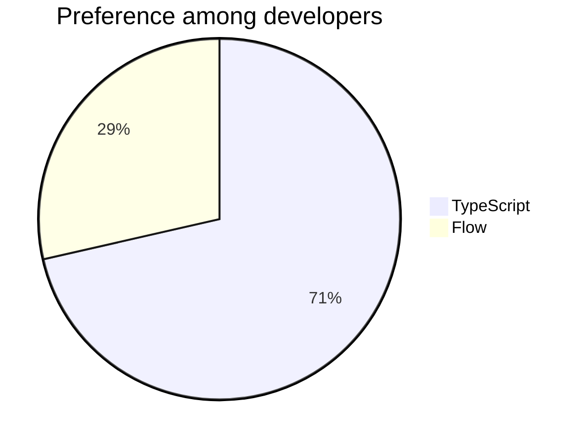

# Frontend type checking (revisited)

## Context

Because of [Dynamic typing in frontend](../Issues/002 Dynamic typing in frontend.md) we have to reconsider [Frontend type checking](003 Frontend type checking.md). In fact, it is now evident that we need static type cheking for the frontend. The decision now is which technology to use.

## Options

### TypeScript

See [Switch to TypeScript for frontend development](../Improvements/001 Switch to TypeScript for frontend development.md).

### Flow

See [Use Flow to type-check frontend code](../Improvements/002 Use Flow to type-check frontend code.md).

## Outcome

**Chosen option:** TypeScript

From an architecture standpoint, we do not have a strong opinion on this. Both options are suitable. Because of this, we go with the preference of the development team.

## Comments

**John Doe** — 2022-05-02

We asked the devlopment team on there opinion on this. Results:

