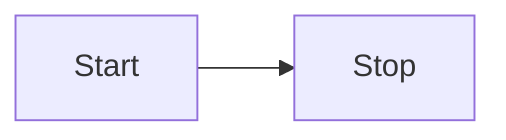

scope42 supports formatting text with Markdown in most places.

## Basics

For the basic syntax, refer to the [CommonMark documentation](https://commonmark.org/help/).

It is extended by support for [GFM](https://github.github.com/gfm/) (GitHub Flavored Markdown). This enables auto-detection of links, footnotes, strikethrough, tables and tasklists. Example:

```md
# GFM

## Autolink literals

www.example.com, https://example.com, and contact@example.com.

## Footnote

A note[^1]

[^1]: Big note.

## Strikethrough

~one~ or ~~two~~ tildes.

## Table

| a | b  |  c |  d  |
| - | :- | -: | :-: |

## Tasklist

* [ ] to do
* [x] done
```

## Syntax Highlighting

To enable syntax highlighting for code blocks, you need to specify the language. Example:

~~~
```javascript
console.log("Hello World")
```
~~~

[List of supported languages](https://lucidar.me/en/web-dev/list-of-supported-languages-by-prism/)

## Item Links

There is a custom directive for linking to scope42 items. For example, if you want to reference `issue-42`:

```md
In order to resolve :link{#issue-42}, we need to...
```

## Mermaid Diagrams

You can directly embed different types of diagrams using [Mermaid](https://mermaid-js.github.io). To do this, simply create a code block with `mermaid` as language:

~~~

~~~

For comprehensive guides on the diagram syntax, please refer to the [Mermaid documentation](https://mermaid-js.github.io).
